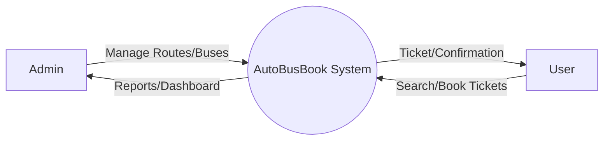
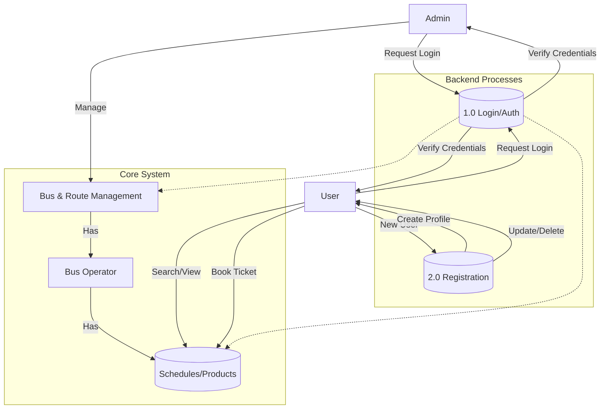

# AutoBusBook System Architecture (DFD)

This document visualizes the **AutoBusBook** system architecture and data flow, structured according to the reference whiteboard sketch provided. It includes a high-level Context Diagram (Level 0) and a detailed Data Flow Diagram (Level 1).

## Level 0: Context Diagram

High-level interaction between the System and external entities (Admin, User).

## Level 1: Data Flow Diagram

Detailed breakdown of processes including Authentication, Administration, and Booking flows.

## Detailed Component Breakdown

### 1.0 Authentication (Login)
-   **Inputs**: Email, Password (or OTP for Users).
-   **Process**: Verify credentials against `users` table.
-   **Outputs**: Session Token, Admin/User Access Rights.

### 2.0 Registration
-   **Inputs**: Name, Email, Phone, Age.
-   **Process**: Create new entry in `users` table. Check for duplicates.
-   **Outputs**: New User Profile.

### Core Modules (E-Commerce equivalent)
-   **Bus & Route Management**: Admin adds routes (`/admin/routes`) and manages buses.
-   **Bus Operator (Retailer equivalent)**: The entity providing the service (e.g., Zingbus, IntrCity).
-   **Schedules/Products**: The actual bookable items. Users "View" and "Buy" (Book) these.

### User Interaction
-   **View/Buy**: Users search for buses (`/api/search`) and complete bookings (`/api/book`).
