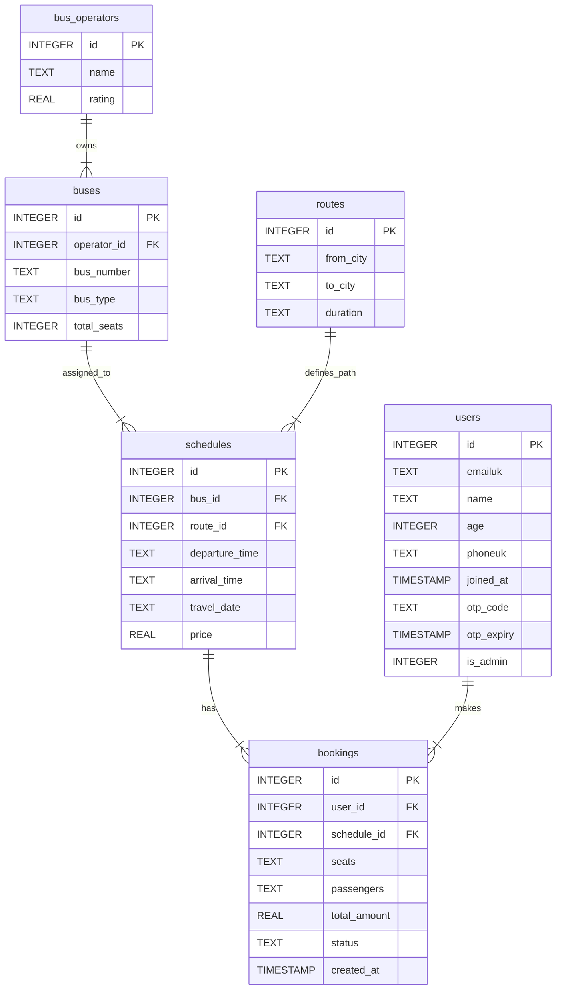

# AutoBusBook Project Analysis & ER Diagram

## Project Overview
**AutoBusBook** is a Flask-based bus booking application. It facilitates user registration, searching for buses, seat selection, and booking management with PDF ticket generation and email notifications.

-   **Backend**: Python (Flask) with SQLite (`autobus.db`)
-   **Frontend**: HTML/CSS/JS (Templates)
-   **Key Modules**:
    -   **Auth**: User registration, Login, OTP verification (via Email/Mock).
    -   **Admin**: Dashboard, Route management, Booking views.
    -   **Booking**: Search, Seat selection, Payment simulation, Ticket generation (PDF + QR).

## Database Schema Analysis

The database consists of 6 core tables. Below is the detailed breakdown of each entity, its attributes, and relationships.

### Entities

1.  **`users`**
    *   **Description**: Stores registered users and admins.
    *   **Primary Key**: `id`
    *   **Attributes**:
        -   `email` (Unique)
        -   `name`
        -   `age`
        -   `phone` (Unique)
        -   `joined_at`
        -   `otp_code` (For 2FA/Login)
        -   `otp_expiry`
        -   `is_admin` (0 = User, 1 = Admin)

2.  **`bus_operators`**
    *   **Description**: Companies that own the buses.
    *   **Primary Key**: `id`
    *   **Attributes**:
        -   `name`
        -   `rating`

3.  **`buses`**
    *   **Description**: Physical bus units.
    *   **Primary Key**: `id`
    *   **Foreign Key**: `operator_id` -> `bus_operators(id)`
    *   **Attributes**:
        -   `bus_number`
        -   `bus_type`
        -   `total_seats`

4.  **`routes`**
    *   **Description**: Defined paths between two cities.
    *   **Primary Key**: `id`
    *   **Attributes**:
        -   `from_city`
        -   `to_city`
        -   `duration`

5.  **`schedules`**
    *   **Description**: Specific trips on a specific date and time.
    *   **Primary Key**: `id`
    *   **Foreign Keys**:
        -   `bus_id` -> `buses(id)`
        -   `route_id` -> `routes(id)`
    *   **Attributes**:
        -   `departure_time`
        -   `arrival_time`
        -   `travel_date`
        -   `price`

6.  **`bookings`**
    *   **Description**: Reservations made by users.
    *   **Primary Key**: `id`
    *   **Foreign Keys**:
        -   `user_id` -> `users(id)`
        -   `schedule_id` -> `schedules(id)`
    *   **Attributes**:
        -   `seats` (JSON stored as Text)
        -   `passengers` (JSON stored as Text)
        -   `total_amount`
        -   `status`
        -   `created_at`

## ER Diagram

